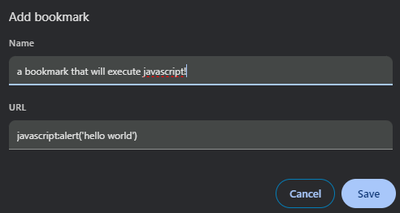

# One Extension To Rule Them All

Hit shift + shift --> run command --> do magic 


## About

A quick intro in what I learned in the process 

### Bookmarklets

Essentially, you can create new book marks that don't lead you to a page, but actually execute javascript 

you do so by prefacing the javascript code you want to run with 

```
javascript://js goes here
```

So if you save your book mark...


... and then click on the book mark on a page 


You can execute that JS!


#### Chrome Browser 

The browser actually lets you do quite a bit from the input bar beyond just javascript: , for example:

```
data:text/html,
```
Into which you can actually inject HTMML and CSS Code such as:

```html
data:text/html;charset=utf-8, <title>Notepad (Nightmode)</title><body contenteditable style="font-family: DejaVu;font-weight:bold;background:%231E1E1E;color:%23FFFFFF;font-size:1rem;line-height:1.4;max-width:80rem;margin:0 auto;padding:2rem;" spellcheck="false">
```

Giving you a cool notepad you can enter by just running a bookmark! 


### Chrome Extensions


If you go to your extensions

```
chrome://extensions/
```

You can toggle on 'developer mode' in the top right corner


Which then gives you the option to load an extension from your computer


Extensions require a ```manifest.json``` file which has the following format:

```json
{
    "manifest_version" : 3,
    "name" : "Your Extension Name",
    "version": "1.0",
    "content_scripts": [
        {
            "matches" : [
                "<all_urls>"
            ],
            "css" : [],
            "js" : [    
                "some-js-library-you-need.js",       
                "core.js"
            ]
        }
    ]
}

```

In your ```core.js``` file we follow a similar approach to what we did with the bookmarklets by creating a JS function and calling it immediately 

```javascript
javascript:(function(){
    // code goes here
})();
```

## My Extension 

I decided to trigger my extension by listening to the shift key being pressed back-to-back within quick succession 

Pressing

```
shift 
+ 
shift
```

will give you a pop-up window asking for which command you wish to run:


The functions that are avaialble within the package are all static methods of the CoreExtension class


```javascript
class CoreExtension {

    static linkedin(){
        navigator.clipboard.writeText("https://www.linkedin.com/in/miarez/");
    }

    static site(){
        navigator.clipboard.writeText("https://stas.website");
    }

    // ... more functions 
}
```

So if you run a command for which a function exists, the JS within the function will trigger and you can use whatever you want !


## To Do

I will keep adding to this repo whenver I think of more cool stuff that could benefit me :) 

